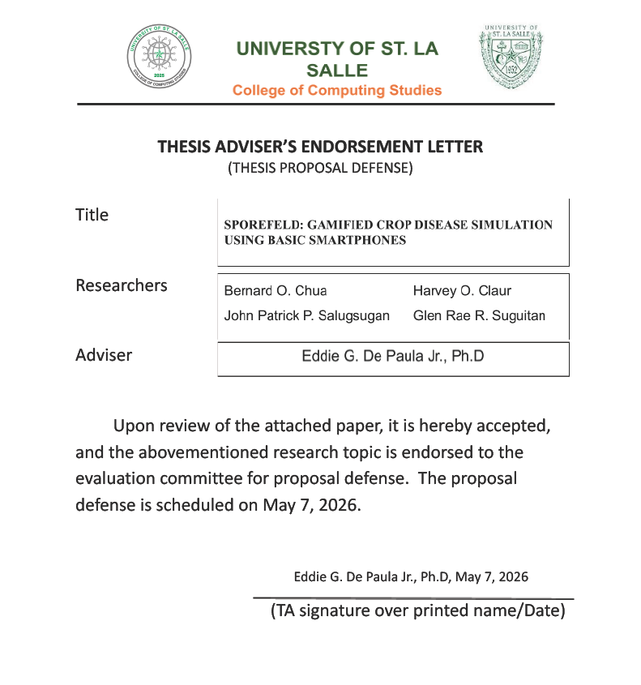
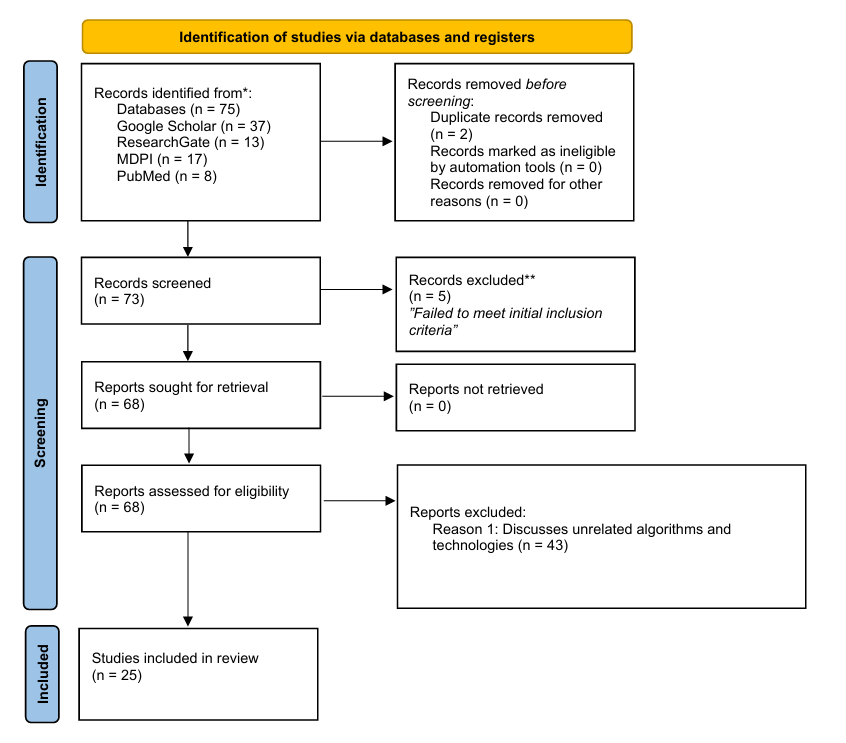
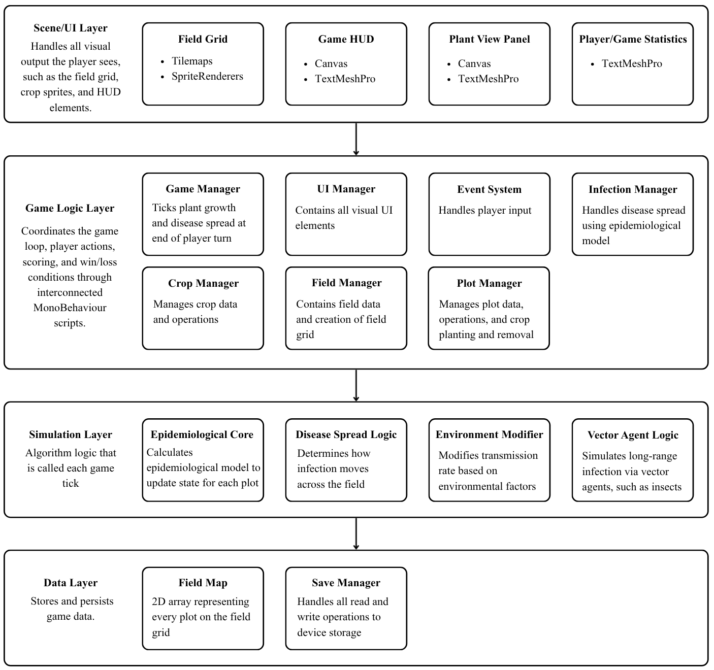
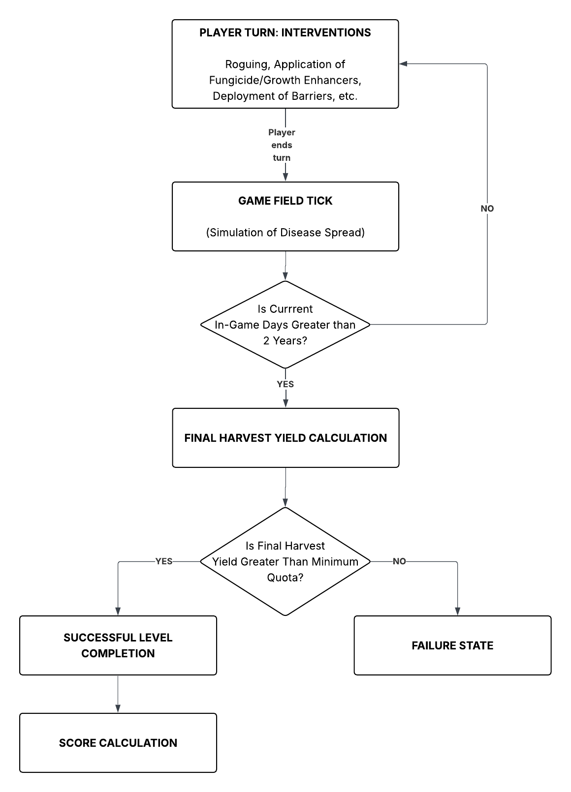

# **SPOREFELD: GAMIFIED CROP DISEASE SIMULATION USING BASIC SMARTPHONES**

A Thesis Presented to
The Faculty of the College of Computing Studies
University of St. La Salle
Bacolod City

In Partial Fulfillment
Of the Requirements for the Degree
Bachelor of Science in Computer Science

**BERNARD O. CHUA JR.**
**HARVEY O. CLAUR**
**JOHN PATRICK P. SALUGSUGAN**
**GLEN RAE R. SUGUITAN**

May 7, 2026

**APPROVAL SHEET**

       The thesis entitled “**SPOREFELD: GAMIFIED CROP DISEASE SIMULATION USING BASIC SMARTPHONES**” presented by **BERNARD O. CHUA JR., HARVEY O. CLAUR, JOHN PATRICK P. SALUGSUGAN, GLEN RAE R. SUGUITAN** in partial fulfillment of the requirements for the degree of Bachelor of Science in **Computer Science** of the University of St. La Salle Undergraduate Programs has been evaluated and approved by the panel of evaluators.

**PANEL OF EVALUATORS**

**JOSEPH MARK ANTHONY HUELGAS**
Chair

| LORETO DAMASCO, Ph.D Member |     | ANDREW GEM LORENZ CABAHUG Member |
|:---------------------------:|:---:|:--------------------------------:|

**EISCHIED ARCENAL, Ph.D**
Adviser

# **TABLE OF CONTENTS**

Page

| TITLE PAGE APPROVAL SHEET THESIS ADVISER ENDORSEMENT LETTER TABLE OF CONTENTS  LIST OF FIGURES LIST OF TABLES INTRODUCTION Background of the Study Statement of the Problem Conceptual Framework Scope and Limitations Significance of the Study Definition of Terms Review of Related Literature METHODS     Research Design Participants of the Study Research Instrument Data-Gathering Procedure Statistical Treatment Design Implementation Test Ethical Considerations REFERENCE | i ii iii iv v vi 1 1 2 3 4 5 6 9 21 21 22 23 24 25 28 31 32 33 35 |
|:-------------------------------------------------------------------------------------------------------------------------------------------------------------------------------------------------------------------------------------------------------------------------------------------------------------------------------------------------------------------------------------------------------------------------------------------------------------------------------------- | -----------------------------------------------------------------:|

**LIST OF FIGURES**

| Figure                                | Page |
|:------------------------------------- | ---- |
| Figure 1: Conceptual framework        | 3    |
| Figure 2: PRISMA flow Diagram         | 10   |
| Figure 3: System Architecture Diagram | 28   |
| Figure 4: Game Mechanic Diagram       | 30   |

**LIST OF TABLES**

| Table                                                      | Page |
|:---------------------------------------------------------- | ---- |
| Table 1: Summary of Related Literature                     | 10   |
| Table 2: Application of the SIR/SIRS Model in the Study    | 19   |
| Table 3: Likert-Scale Interpretation                       | 26   |
| Table 4: Cronbach’s Alpha Reliability Interpretation       | 26   |
| Table 5: System Usability Scale (SUS) Score Interpretation | 27   |
|                                                            |      |

# **INTRODUCTION**

## **Background of the Study**

Disease-causing microorganisms reduce global crop yields by around 20% to 30% annually, directly threatening the stability of our food economy (Lim et al., 2023). This threat is particularly critical in localized agricultural hubs like Bacolod City and the broader Negros Occidental province, where agricultural production dictates the regional economy. The selection of sugarcane, rice, and corn as the focus crops for this study is strongly justified by their indispensable socio-economic importance and statistical dominance in the region. According to the Philippine Statistics Authority, these three crops are included in the top five crops by area and production in Negros Occidental (Philippine Statistics Authority, 2025\). Because these three crops form the absolute foundation of the regional export economy, protecting them from epidemiological threats is essential. However, mitigating these threats requires a public that truly understands the severity of plant pathology and agricultural science. Despite the importance of agriculture, most younger generations are becoming more detached from the basic knowledge of agriculture. Some view the agriculture sector as a low-status career with unstable income, noting that a lack of access to land and capital makes agricultural knowledge irrelevant to their futures (Faturohman et al., 2023). Traditional educational methods often fail to show the pure concept of how crop diseases actually spread, making it difficult for non-agriculture experts to understand the importance of crop protection.
As digital technologies continue to evolve, they have become one of the primary mediums for education and entertainment. However, digital tools designed to raise awareness about agricultural science remain limited. Gamification is currently recognized as a highly effective approach in modern education, noting its effectiveness in improving motivation, collaborative abilities, and psychological relief (Kozub et al., 2025). Gamification is capable of transforming abstract scientific concepts into more interactive and engaging experiences for young generations, which can be a more effective approach in raising awareness than traditional learning methods. Though some studies have already integrated gamification into educational approaches, existing agricultural games often focus on simplified farming mechanics like planting and harvesting, rather than showing the complex side, like how crop diseases spread or how they can be managed or prevented (Braydent & Fajar, 2025). This highlights the gap in digital tools for cultivating agricultural awareness and interest in plant pathology among non-agricultural students. In real-world agricultural science, predicting disease spread relies heavily on complex mathematical frameworks, such as SIR (Susceptible-Infectious-Recovered) epidemiological model. While this mathematical model is the gold standard for tracking epidemics, it is traditionally represented through differential equations that are inaccessible to undergraduate students outside of specialized scientific fields.
The study aims to explore suitable epidemiological models to identify an optimized algorithm that can accurately simulate the spread and control of crop diseases. By integrating an epidemiological model into an accessible, gamified simulation focused on Bacolod City’s major crops, the study intends to help undergraduate students understand the effects of crop diseases and the actions required to mitigate them. This game aims to cultivate empathy for the agriculture sector and inspire a renewed interest in agricultural science, which could potentially influence future career choices and encourage more support for global food security.

## **Statement of the Problem**

This study aims to evaluate the current understanding of crop disease epidemiology among undergraduate students to identify the level of awareness. Furthermore, it proposes the development of an optimized, mobile gamification application as a potential solution to address these gaps. The following were the specific queries the study answered:

1. What is the level of awareness regarding crop disease epidemiology among undergraduate students?
2. What algorithms achieve scientifically accurate crop epidemic modelling while being optimized for resource-hardware mobile devices widely available to undergraduate students?
3. What technology stack allows an efficient and optimized implementation of realistic crop epidemic modelling for mobile devices and platforms accessible to our target users?
4. What is the level of usability of the crop disease educational mobile game among undergraduate students in terms of engagement and content relevance?

## **Conceptual Framework**

*Figure 1: Conceptual framework*

The study employs a logic model framework to systematically illustrate the relationship between its inputs, processes, outcomes, and outputs. Undergraduate students serve as the target population, bringing a baseline level of agricultural awareness, which serves as the measurable starting point for the study, alongside a developed mobile gamification application, designed around the ARCS Model. These inputs guide the design and implementation of the application, culminating in a testing phase where students interact with the mobile game to evaluate its usability, functionality, and overall user experience.  Data will be gathered at the end of the testing phase to measure motivation, engagement, and overall usability through the System Usability Scale (SUS) surveys. The resulting outcomes include an evaluated educational tool that fosters higher student satisfaction, engagement, and an improved capacity to understand crop disease spread patterns through interactive simulation. Ultimately, this study aims to develop a mobile educational tool that promotes practical, field-ready skills and expertise through immersive, gamified simulations instead of memorization of theoretical knowledge. Furthermore, the game promotes targeted, sustainable pesticide application and fosters a new generation of technologically literate professionals by bridging the digital divide in the Philippine agricultural sector.

## **Scope and Limitation**

This study focuses on developing a mobile game application designed to raise awareness of crop epidemiology. While the developed educational mobile game is ultimately designed for the broader population of undergraduate students in the Philippines, the scope of data gathering for this specific study is restricted to a localized representative sample. Specifically, respondents for both the baseline requirements gathering and the final usability evaluation will be purposively selected from undergraduate institutions strictly within Bacolod City. This localized sampling approach allows the researchers to efficiently gather valid, representative data within the given timeframe while ensuring the application’s design remains scalable for the general undergraduate demographic.

The application's core functionality involves simulating crop disease outbreaks through computational implementation of an compartmental epidemiological model, demonstrating the impact of environmental variables and human intervention. To ensure localized relevance, the agricultural scope is limited to the three most commonly consumed crops within the city. These crops are Rice, Sugarcane, and Corn, focusing specifically on each of their three (3) most significant pathological threats.

The usability of the game application will be assessed by examining the game's functionality and ease of use, and its educational value. This study prioritizes gathering user feedback regarding the game's interface responsiveness and ease of navigation, as well as the relevance and clarity of its educational content. The application will be developed for mobile platforms to ensure accessibility. Field testing and user evaluation will be conducted in areas within Bacolod City. The results may not be generalized to individuals with different levels of technological literacy or areas with different digital infrastructure.

As an educational mobile game, the application will not act as an exhaustive encyclopedia of all known crop diseases, but will focus strictly on the three (3) most frequent and economically significant diseases affecting the three chosen crops. Furthermore, the study assumes users have access to basic smartphones and will not provide hardware or utilize high-end technologies like VR or AR, which remain financially inaccessible to the target demographic. Finally, while an initial download is required, the application is designed for offline functionality to accommodate the unreliable internet connectivity prevalent in many Philippine rural farming communities.

## **Significance of the Study**

The following stakeholders will directly benefit from the results of this study:
**Undergraduate Students.** This study is significant for undergraduate students as it addresses the critical intersection of food security and agricultural sustainability in the Philippines. By visualizing the impact of destructive plant pathogens through a crop disease modeling game, the application raises awareness about the micro-biological threats that compromise annual crop yields. This interactive approach helps bridge the gap between higher education students and the fundamental challenges of modern farming. Furthermore, the study aims to foster a deeper interest in agricultural science, inspiring students to recognize the vital nature of the sector and its potential for technological innovation.
**Developers.** For the technology sector, this research highlights an optimized technology stack and framework for implementing and integrating appropriate epidemiological algorithms, on entry-level mobile hardware. It serves as a proof of concept for creating offline capable, mobile optimized software that functions in resource-constrained rural areas, effectively addressing the digital divide in the Philippine context.

**Agricultural Agencies and Educators.** For institutions such as the Department of Agriculture and agricultural educators, this study introduces a modern, gamified medium for information dissemination. The localized focus on rice, sugarcane, and corn diseases provides these stakeholders with an interactive supplemental tool that can be used to easily explain complex disease transmission vectors and crop management methods to younger generations.

**Future Researchers.** The study holds importance for future researchers as it provides a baseline for designing and evaluating the usability and user acceptance of mathematical-based gamified applications. The findings offer valuable data on crop disease spread patterns for rice, corn, and sugarcane, and provide a scalable logic model that can be expanded to include different climatic zones or more advanced technologies like VR and AR.

## **Definition of Terms**

To ensure a common understanding of the technical and contextual elements of this research, the following terms are defined both conceptually and operationally:

**Compartmental Model. \-** Conceptually, it refers to a form of mathematical epidemiology to compute the theoretical number of hosts infected with a contagious disease in a closed population over time (Carlsson et al, 2023). It partitions a population into three distinct categories: Susceptible ($S$), those who can contract the disease; Infectious ($I$), those currently capable of transmitting it; and Recovered ($R$), those who have been removed from the population either by gaining immunity or through death. The Compartmental Model is operationally defined as the mathematical framework used to accurately simulate the progression of diseases among 3 crops, sugarcane, rice, and corn, through a virtual field. Within the game mechanics, the "Susceptible" variable represents healthy crop units vulnerable to infection; "Infectious" represents diseased units capable of spreading the pathogen to adjacent cells or plots; and "Recovered" (or Removed) signifies units that are either harvested, destroyed, or have reached a state of immunity after fighting a prior infection and are no longer capable of spreading the disease.

**Gamification. \-** Conceptually, it refers to the strategic use of game design elements, such as scoring, competition, and rules of play in non-game contexts to improve user engagement and learning (Kostas et al, 2025). Within the context of this study, gamification is operationally defined as the implementation of crop disease modelling and management as an educational mobile game. Students practice crop disease identification and treatment application through a level-based simulation with game mechanics, such as point systems, progress bars, and a daily reward system, to incentivize learning.

**Crop Disease Epidemiology.** \- Conceptually, it refers to the study of the distribution and determinants of health-related states or events in plant populations, and the application of this study to the control of health problems (Li et al, 2021). Within the context of this study, Crop Disease Epidemiology is operationally defined as the specific subject matter being taught to the respondents through the educational mobile game. The mobile game's educational objectives focus on the practical identification of visual symptoms, the analysis of spread patterns dictated by the SIR model, and the proper administration of treatments.

**ARCS Model (Attention, Relevance, Confidence, Satisfaction**)**.** \- Conceptually, it refers to an instructional design model developed by John Keller that focuses on the motivational aspects of learning environments. It posits that for learning to be effective, the instruction must first capture the learner's Attention through arousal and curiosity; establish Relevance by linking content to the learner’s goals and past experiences; build Confidence by providing clear expectations and opportunities for success; and ensure Satisfaction through intrinsic and extrinsic rewards.(Xu et al., 2024).Within the context of this study, the ARCS Model is operationally defined as the primary framework used to evaluate and quantify the students' motivation and engagement levels after interacting with the mobile game.

**Usability.** \- Conceptually, it refers to a fundamental software quality attribute that determines the degree to which a product allows users to perform specific tasks effectively, efficiently, and with satisfaction (Weichbroth, 2024). In the context of mobile interfaces, it emphasizes minimizing cognitive load through error prevention, high memorability, and intuitive navigation. A usable system ensures that the technical complexities of the underlying software, such as backend algorithms or data processing, remain transparent to the user, allowing them to focus entirely on the primary objectives of the application without being hindered by the interface itself. Within the context of this study, Usability is operationally defined as the ease with which students can navigate the mobile game interface and execute the game loop. It focuses on the user's ability to interact with the game mechanics, identifying disease symptoms, administering treatments, and containing disease spread, without being obstructed by technical errors or UI confusion.

**Engagement. \-** Conceptually defined as a student's subjective perception of their active experience, involvement, and participation during the game process, serving as a vital mediator between digital educational games and a student's overall motivation to learn by transforming positive gameplay experiences into positive educational attitudes (Li et al., 2024). In the context of this study, engagement is operationally defined as the extent to which undergraduate students actively interact, focus, and immerse themselves in the crop disease mobile game. It is quantitatively measured during the User Acceptance Testing (UAT) phase using the ARCS Model framework, specifically the Attention and Satisfaction components, to evaluate the game's ability to maintain the player's interest and drive to complete the disease management simulation**.**

**Content Relevance.** \- Conceptually refers to the degree to which educational materials and activities are perceived as personally meaningful, applicable, and aligned with a learner's real-world goals or interests, which, when grounded in instructional frameworks like the ARCS model, is essential for sustaining student motivation (Christopoulos & Mystakidis, 2023). Within the scope of this study, content relevance is operationally defined as the direct applicability of the in-game agricultural scenarios to the real-world context of the respondents. This is achieved through localized data focused on the most prevalent diseases affecting the three major crops in Bacolod City (Rice, Sugarcane, and Corn). The realism, scientific accuracy, and practical usefulness of the simulation is measured using a researcher-made survey that has undergone content validation by a panel of subject matter experts and reliability testing via a pilot study, yielding a Cronbach’s alpha coefficient that confirms its internal consistency and technical accuracy.

    **Roguing. \-** Conceptually refers to a management strategy that involves the manual removal of atypical plants. It highlights that by reducing the presence of undesirable plants, roguing directly lowers inoculum pressure and minimizes the exposure of healthy plants to pathogens (Cotaet et al., 2025).  Within the context of the study, roguing refers to an active player-intervention mechanic. It allows the user to manually select a crop tile currently in the Infected (*I*) state and remove it from the simulation grid. This action immediately forces the selected tile to transition into the Recovered/Removed (*R*) state, thereby eliminating it as a localized source of disease transmission and actively reducing the simulation's basic reproduction number (*R0*).

## **Review of Related Literature**

The selection of literature followed a rigorous multi-stage screening process guided by our PICOC criteria. A comprehensive search across multiple academic databases, including ResearchGate, Google Scholar, MDPI, and PubMed, using the keywords related to “ agricultural education” or “awareness”, “crop epidemic algorithm” or “modeling”, and “educational gamification”. To identify the relevant literature regarding gamified education and epidemiological models, the researchers gathered an initial 75 papers. From this initial pool, 2 duplicates were identified and removed. A systematic assessment was conducted on the remaining 73 papers to ensure that the literature remained aligned with the study. Through the application of our inclusion and exclusion criteria, 5 papers were excluded for failing to meet the criteria. In the remaining papers, the researchers perform data extraction and abstract analysis. The papers that discuss unrelated algorithms and technologies not aligned to the study were further excluded, resulting in 43 papers. This multi-stage process resulted in a final selection of 25 highly relevant papers.

*Figure 2: PRISMA flow Diagram (Page et al., 2021\)*

Table 1: Summary of Related Literature

| Citation                         | Study Design                     | Source                                                                     | Description                                                                                                                                                                                                                                                      |
| -------------------------------- | -------------------------------- |:--------------------------------------------------------------------------:| ---------------------------------------------------------------------------------------------------------------------------------------------------------------------------------------------------------------------------------------------------------------- |
| Adamopoulos et al. (2025)        | Epidemiological simulation study | Mesopotamian Journal of Artificial Intelligence in Healthcare              | Applied graph theory algorithms in analyzing infection dynamics of COVID-19.                                                                                                                                                                                     |
| Amanova et al. (2026)            | Computational simulation study   | Applied Sciences                                                           | Integrated stochastic SIRS modeling with computer vision-based agricultural robotics.                                                                                                                                                                            |
| Bashabsheh (2025)                | Computational simulation study   | International Journal of Mathematical, Engineering and Management Sciences | Combined stochastic compartmentalization and cellular automata for epidemic spread simulation.                                                                                                                                                                   |
| Bassanelli et al. (2025)         | Systematic literature review     | Acta Psychologica                                                          | Analyzed gamification as a persuasive strategy for behavioral change and engagement.                                                                                                                                                                             |
| Benson et al. (2021)             | Epidemiological simulation study | PLOS Computational Biology                                                 | Examined direct transmission models for environmentally persistent pathogens.                                                                                                                                                                                    |
| Best & Cunniffe (2026)           | Mathematical modeling study      | PLOS Computational Biology                                                 | Applied a lattice-based mathematical modeling approach to analyze the local and global transmission dynamics of Bahia bark scaling of citrus.                                                                                                                    |
| Boncu et al. (2022)              | Systematic literature review     | Sustainability                                                             | Reviewed gamified applications for environmental awareness and behavior change.                                                                                                                                                                                  |
| Braydent & Fajar (2025)          | Quantitative evaluation study    | BIO Web of Conferences                                                     | Developed a 3D farming simulation game to raise awareness regarding food crises and agriculture.                                                                                                                                                                 |
| Chandran et al. (2025)           | Comprehensive literature review  | Journal of Sustainable Technology in Agriculture                           | Reviewed mathematical modeling approaches for plant disease epidemic curves.                                                                                                                                                                                     |
| Chapman et al. (2025)            | Computational simulation study   | PLOS Computational Biology                                                 | Simulated containment strategies for Xylella fastidiosa plant disease spread.                                                                                                                                                                                    |
| De Silva et al. (2026)           | Mixed-methods study              | International Journal of Advanced Computer Science and Applications        | Developed an offline mobile learning system integrating augmented reality, artificial intelligence, and game-based learning for agriculture education.                                                                                                           |
| Dernat et al. (2025)             |                                  | Agricultural Systems                                                       | Evaluated serious games used in agricultural education and sustainability.                                                                                                                                                                                       |
| Fantaye et al. (2025)            | Mathematical modeling study      | Scientific Reports                                                         | Proposed and analyzed a compartmental mathematical model to describe the transmission dynamics of wheat yellow rust disease on wheat crops and evaluate the effectiveness of fungicide treatments.                                                               |
| Faturohman et al. (2023)         | Descriptive Survey               | Review of Integrative Business and Economics Research                      | Studied youth perceptions and attitudes toward agriculture.                                                                                                                                                                                                      |
| González-Domínguez et al. (2020) | Epidemiological simulation study | Agronomy                                                                   | Developed a general mathematical model to simulate the impact of various crop management practices on the progress of polycyclic plant disease epidemics.                                                                                                        |
| Gutiérrez-Jara et al. (2023)     | Mathematical modeling study      | Plants                                                                     | Modeled agricultural mitigation measures against the spread of Sharka disease in sweet cherry orchards.                                                                                                                                                          |
| Huancas et al. (2024)            | Mathematical modeling study      | Mathematical Biosciences and Engineering                                   | Presented a mathematical model to describe the seasonal spread of flavescence dorée in grapevines, aiming to improve epidemiological understanding and disease management strategies.                                                                            |
| Ochwach et al. (2025)            | Mathematical modeling study      | Journal of Mathematical Analysis and Modeling                              | Proposed and analyzed a compartmental mathematical model to describe the transmission dynamics of wheat yellow rust disease on wheat crops and evaluate the effectiveness of fungicide treatments.                                                               |
| Melikechi et al. (2022)          | Mathematical modeling study      | Journal of Mathematical Biology                                            | Provided novel theoretical insights into the limits of epidemic prediction using the Susceptible-Infectious-Recovered (SIR) model, specifically focusing on the practical identifiability of model parameters based on noisy data gathered early in an outbreak. |
| Mercado & Osbahr (2023)          | Descriptive Case Study           | Asian Journal of Agriculture and Development                               | Utilized a descriptive case study approach in analyzing the factors influencing Filipino youth's intention to pursue agricultural careers.                                                                                                                       |
| Nishihata et al. (2023)          | Mathematical modeling study      | Applied Sciences                                                           | Proposed a novel epidemiological model integrating evolutionary game theory to predict infection dynamics and forecast pharmaceutical demand for inventory management.                                                                                           |
| Shukla et al. (2026)             | Descriptive Research             | Journal of Experimental Agriculture International                          | Employed a descriptive research design using simple random sampling to assess the levels of awareness, knowledge, and sociodemographic associations regarding natural farming among agricultural postgraduate students.                                          |
| Tresna et al. (2023)             | Systematic literature review     | Jambura Journal of Biomathematics                                          | Conducted a systematic literature review to analyze mathematical models for plant disease transmission.                                                                                                                                                          |
| Wang et al. (2025)               | Mathematical modeling study      | PLOS ONE                                                                   | Proposed a mathematical model based on behavioral game theory on a two-layer network to analyze the dynamic interaction between individual protective behaviors and the spread of infectious diseases.                                                           |
| Yang & Ding (2022)               | Epidemiological simulation study | Frontiers in Plant Science                                                 | Developed simulation algorithms and a time-varying generic model to visualize the appearance and dynamic spread of various plant diseases based on their symptom classifications.                                                                                |

**Student Awareness and Attitude Toward Agriculture**
Currently, the agricultural sector is experiencing a generational crisis, as younger generations are losing interest in learning or pursuing farming and agricultural sciences. Mercado and Osbahr (2023) emphasize that while the younger generations are critical to building a sustainable, resilient, and inclusive agricultural industry, their intent to learn in the agriculture sector remains low. Their study highlights that younger generations often view the agricultural sector as physically demanding and low-income, rather than as a viable profession. This lack of interest does not necessarily imply a total lack of exposure to agricultural information. Mercado and Osbahr (2023) further emphasize that the youth reports have high levels of exposure to agricultural information. However, this has not been effectively applied to a genuine academic pursuit. This highlights the gap between basic awareness and practicality, indicating that traditional methods of agricultural knowledge are insufficient.
To address this gap, researchers have sought to evaluate and measure the levels of students' awareness regarding agricultural methods. Studies regarding student perceptions indicate that most students have only a basic understanding towards agricultural sustainability and its social and economic impact. According to Faturohman et al. (2023), this lack of awareness often leads to low interest and weak engagement in the agricultural sector. Even among students within the agriculture sector, there is still a lack of comprehensive knowledge. A recent study by Shukla et al. (2026) assessing the awareness and knowledge dynamics of natural farming among agriculture students emphasizes that while the majority of students had a relatively high conceptual understanding regarding agriculture, their overall level of awareness only possessed a moderate level.
While the studies clearly indicate that the younger generations are disengaged from agriculture due to outdated perceptions, there is a significant lack of interactive mediums that are designed to bridge the gap between non \-agriculture students. Traditional methods in education are often insufficient for bridging the gap between conceptual awareness and deep technical appreciation. Utilizing an educational mobile game to simulate complex agricultural sciences, such as crop epidemiology and mathematical modeling, serves as a highly effective intervention.

**Gamification and Game-Based Learning in Education**
The integration of gamification and game-based learning into digital platforms has proven to be a highly effective approach for transforming complex concepts into accessible and engaging experiences for users. Gamification integrates game elements such as progression systems and challenges into non-game contexts to actively convince users and motivate behavioral shifts. Bassanelli et al. (2025) recently conducted a systematic review on the persuasive power of game-based methods, highlighting how gamified systems successfully encourage users to adapt to sustainable behaviors and change their perspectives on global issues. Furthermore, their study highlights that integrating gamification with persuasive strategies aligns with core motivational frameworks. For this study, these persuasive mechanics directly fulfill the criteria of the ARCS model (Attention, Relevance, Confidence, and Satisfaction). Recent software evaluations demonstrate the technical effectiveness of integrating such incentive frameworks into a digital environment. A recent study by De Silva et al. (2026) on advanced computer applications demonstrates that well-structured, gamified mobile environments significantly enhance user motivation and cognitive retention when compared to static digital learning. By translating the complex mathematical mechanics of the compartmental model into visual elements, the researchers are able to successfully capture the attention and relevance needed to engage younger generations who view traditional scientific methods as not interesting enough.
The capacity to persuade and engage has proven relevant in environmental and ecological education. Traditional education methods often struggle to bridge the gap in perceiving environmental threats and establish proactive behaviors among younger generations. A recent systematic review conducted by Boncu et al. (2022) titled “Gameful Green” investigates the impact of serious games and gamified mobile apps on environmental awareness. Their study provides scientific evidence that gamified mobile apps are a highly effective approach for fostering pro-environmental information, attitudes, and behaviors. Mobile applications simulate real-life situations in a safe environment, which allows users to understand cause-and-effect. This study supports the goal of using a mobile game approach, not only for entertainment but also to improve awareness and attitudes towards crop diseases.
Since gamification has been effective in general environmental information, these approaches have expanded and have been applied to address specific challenges within the agriculture sector. A recent systematic review of serious games used in agriculture, Dernat et al. (2025), evaluated the importance of digital tools in teaching farming practices. The authors emphasize that these serious games are potentially “sustainable game changers”, highlighting their effectiveness in promoting awareness regarding agricultural systems and responsible farming transitions. This is complemented by a recent study in biological sciences, which demonstrates that interactive digital tools and virtual simulations are becoming increasingly significant for presenting complex biological data, such as ecological threats and plant pathology, to non-agriculture audiences (Braydent & Fajar, 2025). However, their current study also indicates a significant gap in the existing literature. The vast majority of available agricultural games focus on general farm management, resource allocation, or basic crop cycles. There is a lack of gamified applications that accurately model specific, mathematical processes, such as the epidemiological spread of crop diseases. These gaps perfectly contextualize the necessity of the current study. While the literature proves that gamified mobile apps effectively foster environmental awareness (Boncu et al., 2022\) and serve as an innovative tool in agricultural education (Dernat et al., 2025), there are currently no accessible educational games that simulate accurate mathematical models. Therefore, integrating an appropriate epidemiological algorithm into a gamified mobile experience not only addresses the significant gap in current agricultural serious games but also actively applies the proven persuasive power of game-based learning (Bassanelli et al., 2025\) to bridge the gap between the complexity of agricultural science and the young generation.

**Epidemiological Modeling and the Algorithmic Approaches**
Mathematical modeling has proven to be a crucial and highly effective tool in modern epidemiology, providing a framework for understanding, predicting, and controlling the transmission patterns of infectious diseases. The core of this scientific field is compartmental models, specifically the SEIR (Susceptible, Exposed, Infectious, Recovered) model and its variations, such as the SIR and SIRS. These models categorize populations into compartments and track the rate of disease spread between them over time. Historically, compartmental models have been widely used in human epidemiology, accurately predicting epidemic sizes during quarantine and isolation (Benson et al., 2021\) and mapping complex infection dynamics using graph-based methods, such as those applied during the COVID-19 pandemic (Adamopoulos et al., 2025). Building on this established mathematical foundation, researchers have found that compartmental models are also effective in agricultural science and plant pathology.
In the agricultural sector, simulating the disease progression curve has become essential for safeguarding global food security. A recent study by Chandran et al. (2025) highlights that mathematical modeling is currently the gold standard for simulating crop disease transmission. The SIR model and its stochastic variations, such as the SIRS model, are actively used to simulate precise, real-world agricultural threats. The SIR model’s adaptability is demonstrated by its effective application to a wide range of crops and plant diseases. Recent studies confirm its relevance across various agricultural contexts. For instance, Fantaye et al. (2025) mathematically analyzed the transmission dynamics of wheat yellow rust, while Huancas et al. (2024) predicted the impacts of seasonality on flavescene dorée in grapevines. Additionally, Ochwach et al. (2025) tracked reinfections of rice blast, and Chapman et al. (2025) created simulation tools for the containment of Xylella fastidiosa. Furthermore, recent advanced studies by Amanova et al. (2026) have successfully integrated the stochastic SIRS model with computer vision-based robots to predict and cure greenhouse strawberry infections. This demonstrates that these mathematical models can be integrated with modern digital technologies.
Beyond predicting infection rates, epidemiological models are crucial for analyzing spatial dynamics and the effectiveness of agricultural mitigation measures. Complex variations of the SIR model, such as lattice models with local and global transmission parameters (Best & Cunniffe, 2026), allow researchers to simulate the spatial dynamics of epidemic spread across large geographic areas (Bashabsheh, 2025). By performing these algorithmic simulations, researchers may precisely quantify the effects of various crop management strategies (González-Domínguez et al., 2020\) and agricultural mitigation measures, such as modeling Sharka disease transmission (Gutiérrez-Jara et al., 2023). Recent advancements have begun to integrate behavioral game theory into epidemiological models to study how human behavior affects the prediction and spread of diseases (Wang et al., 2025; Nishihata et al., 2023). The integration of human behavior and mathematical prediction emphasizes the significance of human intervention, a mechanism that readily fits into interactive, player-driven simulations.
To transform these mathematical frameworks into a digital landscape, researchers have also explored the integration of epidemiological algorithms and visual simulations. A recent study by Yang & Ding (2022) developed algorithms for the appearance simulation of plant diseases based purely on symptom classification and mathematical disease stages. This study proves that mathematical data from an SIR model can be transformed visually into digital platforms.
Despite the broad scientific support of the SIR model for predicting crop diseases, there are still limits to epidemic prediction using pure mathematical models (Melikechi et al., 2022). The current majority of agricultural modeling is limited to advanced learning, focuses on complex stochastic modeling, and global transmission mathematics that are inaccessible to younger generations (Tresna et al., 2023). While it is scientifically proven that the SIR model is ideal for mapping crop diseases and simulating visuals, there is still a distinct lack of tools that simplify these mechanics for educational purposes. By exploring established frameworks such as compartmental models for gamified mobile landscape, this study bridges the gap between the advanced agricultural epidemiology models and the comprehension of students, transforming complex mathematical frameworks into an accessible, interactive learning tool.

Table 2: Application of the SIR/SIRS Model in the Study

| Model Variable              | Standard Theoretical Definition                                                   | Application in the Study                                                                                                                                                                                                                        |
| --------------------------- | --------------------------------------------------------------------------------- | ----------------------------------------------------------------------------------------------------------------------------------------------------------------------------------------------------------------------------------------------- |
| **Susceptible (*S*)**       | Individuals in a population who are currently healthy but can catch the disease.  | Represents the healthy crop units vulnerable to diseases                                                                                                                                                                                        |
| **Infected (*I*)**          | Individuals who have contracted the disease and are capable of transmitting it.   | Represents diseased units capable of spreading the pathogen to adjacent cells or plots                                                                                                                                                          |
| **Recovered (*R*)**         | Individuals who have recovered from the disease and developed immunity (or died). | Signifies units that are either harvested, destroyed, or have reached a state of immunity after fighting a prior infection and are no longer capable of spreading the disease.                                                                  |
| **Transmission Rate (*β*)** | The rate at which a susceptible individual becomes infected.                      | The rate or probability at which a healthy crop unit (Susceptible) becomes infected upon contact with a pathogen, modulated by environmental variables (such as high humidity or rain) and the proximity to already infected neighboring plots. |

#

#

#

#

#

#

#

#

# **METHODS**

## **Research Design**

To achieve the primary objective of creating an educational mobile game designed to raise awareness on agricultural science, specifically around crop diseases and its appropriate interventions, the study employed a Design and Development Research (DDR) design with a focus on tool development. This type of research design was selected because it systematically studies the process of designing, developing, and evaluating an instructional tool, which is the crop epidemiology educational mobile game.
Data collection will be performed using a convergent parallel mixed-methods design, in which the researchers collect and analyze quantitative and qualitative data. The quantitative approach will be utilized in the preliminary phase to measure the undergraduate students baseline level of awareness and the final phase to measure the system usability metrics. Conversely, the qualitative approach will be used during the intermediate phase to gather in depth insights from domain experts regarding mathematical model optimization.
This design allows for a more comprehensive understanding of the usability of the tool throughout the development process. To assess and refine the mobile game during pre-alpha development, data collection will be performed with experts and end-users at the end of every Agile sprint using the usabiulity testing framework. A final summative UAT will be performed at the alpha/beta stages to assess the mobile game’s effectiveness as an educational tool.
The development process will follow Agile methodology to allow continuous and iterative refinement of the algorithms, gameplay mechanics, and game loops of the educational mobile game to ensure it meets the defined functional and educational criteria. Continuous feedback from experts and end-users at the end of every sprint allows for early detection and fixing of game design issues and/or technical bugs which will result in a higher end-product quality and effectiveness.

## **Participants of the Study**

While the mobile gamified application is ultimately designed for the broader population of undergraduate students, data gathering for this study will be strictly delimited to a localized representative sample to ensure a controlled and feasible research scope. The study will involve two distinct groups of participants, selected via purposive sampling, corresponding to the different phases of the research methodology.
For both preliminary baseline requirements gathering for SOP 1 and for the usability evaluation for SOP 3, participants will be purposively selected from undergraduate students currently enrolled in various higher education institutions within Bacolod City. This multi-institutional group serves as a representative microcosm of the broader target demographic, who are highly reliant on mobile technology but remain largely disconnected from the fundamental agricultural sector.
For the inclusion, participants must be officially enrolled undergraduate students at any college university within Bacolod City, have personal access to basic,entry-level mobile devices, and express a willingness to participate in the surveys and prototype testing.
For the exclusion, to ensure the study accurately benchmarks the baseline level of agricultural awareness among the general student population, undergraduate students enrolled in agricultural disciplines or closely related botanical sciences will be excluded for the study. The target undergraduate student respondents are strictly from non-agricultural disciplines.
The study requires a secondary group of expert participants to validate the system’s core mechanics and educational accuracy prior to deployment. For the content validation, an Agricultural Expert will be purposely selected based on their established expertise in crop science, plant pathology, or related agricultural sectors. They will validate the accuracy and content relevance regarding rice, sugarcane, and corn diseases. For the technical aspects of the study, a technical expert in  IT or Computer Science professional will be selected to evaluate the application’s efficiency of the algorithm, offline capability, and overall technical feasibility.

## **Research Instrument**

In the design of the research instrument, the study will utilize a multi-component approach to gather the baseline requirements, validate technical and domain accuracy, and practical usability of the application for the intended users.

The instrument consists of three major components. The first component consists of a quantitative researcher-made needs assessment survey provided to undergraduate students. This instrument is designed to map the baseline level of awareness regarding crop disease epidemiology, which will directly serve as the baseline requirements for the game mechanics and educational aspects of the game.

The second component utilizes a qualitative approach that targets the domain and technical experts to shape and refine the system logic. For scientific accuracy, content validation surveys will be provided to an expert from the agriculture sector to validate locally utilized management methods for crop diseases. Concurrently, technical evaluation will be provided to an IT/Computer Science expert to assess the feasibility, efficiency, and optimization constraints of the proposed algorithmic framework and technology stacks.

The third component consists of a  mixed-methods Usability and Engagement Evaluation administered to the participants to evaluate the developed educational game. This instrument integrated a hybrid design, utilizing a standardized System Usability Scale (SUS), a ten-item, five-point Likert scale to measure software usability, alongside a supplemental block of researcher-made questions to measure Content Accuracy and Educational Impact specific to agriculture awareness

To ensure the validity and reliability of the researcher-made portion of the usability testing instrument, the questionnaire will undergo content validation through expert review by the research adviser. In addition, pilot testing will be conducted using a group of students not included in the final sample. The internal consistency of the instrument will be measured using Cronbach’s Alpha to determine reliability.

## **Data Gathering Procedure**

The data gathering procedure for this study will be executed in three phases. In the first phase, before the application logic is designed, the researchers will develop a quantitative needs assessment survey for the target undergraduate students. To ensure the reliability and clarity of this researcher-made instrument, it will first undergo content validation by the research adviser. Following this, a pilot test will be conducted with a small sample of students from a local educational institution who will not be included in the final sample. The pilot responses will be analyzed using Cronbach’s Alpha to determine internal consistency. Once validated, the survey will be formally deployed to the target undergraduate respondents in Bacolod City to map out existing levels of awareness regarding crop disease epidemiology, which will directly inform the game's baseline requirements.

For the second phase, the researchers will coordinate with domain and technical experts to shape and refine the system logic. A qualitative content validation survey will be provided to an expert from the agricultural sector strictly to verify the scientific accuracy of the crop profiles, disease characteristics, and locally utilized management methods. Concurrently, a technical evaluation will be conducted with a Computer Science or Information Technology expert to assess the mathematical accuracy of the disease spread models, alongside the feasibility, efficiency, and optimization constraints of the algorithmic framework. The feedback from these experts will directly govern the application's underlying mechanics.

For the final phase, the final data gathering phase will be conducted in a controlled environment, such as designated campus classrooms. The researchers will facilitate the testing sessions, providing the target undergraduate students sufficient time to interact with the gamified simulations on resource-optimized mobile hardware. To reflect the resource-constrained target environment and ensure inclusivity, the application will be tested strictly in an offline capacity.

Following the interaction with the mobile game, participants will be asked to complete the Usability and Engagement Evaluation. This instrument integrates the standardized System Usability Scale (SUS) alongside researcher-made questions to evaluate the application's functional suitability, user engagement, and educational content relevance. The researchers will remain present throughout the session to provide technical assistance and to ensure accurate collection of both qualitative and quantitative data. The data gathered from these sessions will then be compiled and analyzed using appropriate statistical methods to determine the overall user acceptance and viability of the mobile game as a supplementary educational tool.

## **Statistical Treatment**

The data collected from the baseline needs assessment, expert validations, and final usability evaluations will be organized, codified, and processed using spreadsheet software and statistical packages, specifically Microsoft Excel and Jamovi. Prior to data analysis, all responses will undergo codification to ensure a systematic approach. Closed-ended items with predetermined indicators, including the ten-item, five-point Likert scale used in the System Usability Scale (SUS), will be immediately codified into numerical values. In contrast, qualitative data from open-ended feedback and expert evaluation sheets will be compiled, organized into thematic categories through thematic analysis, and assigned descriptive codes.

For the pre-test and pilot test data of the researcher-made questionnaires, Cronbach’s Alpha will be utilized as an internal consistency metric. This tool will measure the reliability of the survey items to ensure that the data-gathering instruments are statistically stable.

For summarizing the demographic profile of the students respondents and categorizing the baseline requirements regarding the students’ level of awareness, Frequency and Percentage Distributions will be utilized

For interpreting the quantitative responses from the researcher-made needs assessment and the supplemental evaluation block measuring user engagement and content relevance, the Mean and Standard Deviation will be utilized. The mean will indicate the central tendency of the student responses, while the standard deviation will measure the data's variability, ensuring an accurate evaluation of the Likert scale data as required by standard research practices.

For evaluating the overall usability of the mobile application during Phase 3, the standard System Usability Scale (SUS) Scoring Algorithm will be applied. Under this framework, the score for odd-numbered items (positive statements) is the scale position minus one, while for even-numbered items (negative statements), the score is five minus the scale position. The sum of these calculated values is then multiplied by 2.5 to convert the final usability score to a standardized scale ranging from 0 to 100\. The resulting scores will be mapped against established adjective rating scales to mathematically determine the application's overall user experience and systemic viability.

Table 3: Likert-Scale Interpretation

| Scale | Mean Score Range | Verbal Interpretation |
| ----- | ---------------- |:--------------------- |
| 5     | 4.21 \- 5.00     | Strongly Agree        |
| 4     | 3.41 \- 4.00     | Agree                 |
| 3     | 2.61 \- 3.40     | Neutral               |
| 2     | 1.81 \- 2.60     | Disagree              |
| 1     | 1.00 \- 1.80     | Strongly Disagree     |

Table 4 : Cronbach’s Alpha Reliability Interpretation (George & Mallery, 2003\)

| Coefficient of Cronbach’s Alpha | Reliability Level |
| ------------------------------- |:----------------- |
| 0.90 \- 1.00                    | Excellent         |
| 0.80 \- 0.89                    | Good              |
| 0.70 \- 0.79                    | Acceptable        |
| 0.60 \- 0.69                    | Questionable      |
| 0.50 \- 0.59                    | Poor              |
| Below 0.50                      | Unacceptable      |

Table 5: System Usability Scale (SUS) Score Interpretation (Bangor et al., 2009\)

| SUS Score Range | Acceptability Range |
| --------------- |:------------------- |
| 85.0 \- 100.0   | Acceptable          |
| 70.0 \- 84.9    | Acceptable          |
| 50.0 \- 69.9    | Marginal            |
| 35.0 \- 49.9    | Unacceptable        |
| Below 34.9      | Unacceptable        |

## **Design**

*Figure 3: System Architecture Diagram*

**System Architecture Diagram.** The system architecture of the crop epidemiology mobile game is organized into four distinct layers, each with a clear and defined responsibility. The Scene/UI layer handles all visual output the player sees, including the field grid rendered through Tilemaps and SpriteRenderers, HUD elements such as the plant view panel, and player and game statistics displayed via Canvas and TextMeshPro components. The Game Logic layer coordinates the game loop and player interactions: GameManager ticks plant growth and disease spread at the end of each player turn, while the UIManager, EventSystem, InfectionManager, FieldManager, PlotManager, and CropManager collectively manage visual state, input handling, field data, plot operations, and crop data respectively. The Simulation layer contains the core algorithmic logic executed each game tick and includes the disease spread logic which calculates and updates the susceptible, infected, and removed state for each plot, the Disease Spread Logic which determines how infection propagates across the field, the Environment Modifier which scales the transmission rate based on environmental conditions, and the Vector Agent Logic which simulates long-range infection through biological carriers called vector-based agents, such as insects. Finally, the Data layer persists and stores all game data, with the Field Map maintaining a 2D array of every plot's current state and the SaveManager handling all read and write operations to the device's persistent storage. Together, these four layers form a clean separation of concerns that keeps visual rendering, game coordination, epidemic simulation, and data management independently maintainable and scalable.

*Figure 4: Game Mechanic Diagram*

**Game Mechanics.** The mobile game operates on a turn-based system where the game field ‘ticks’ at the end of the player’s turn, which allows for the observation of the disease spread at a controlled pace. Each level represents a two-year simulation period, divided into in-game days that includes one player turn and one field simulation tick.

Players are equipped with both reactive and proactive intervention tools designed to strategically mitigate disease propagation. Reactive measures include manual *roguing* to isolate an infected crop and applying targeted fungicides to decrease local transmission rates. Proactive measures include deploying physical barriers or traps to intercept agents of vector-based diseases, such as insects, and applying enhancers to increase the disease resilience of crops. These interventions also influence the plant recovery period, determining the duration required for treated crops to transition from an infected state back to health and restore their contribution to the final yield. The effectiveness of the player’s disease management strategy is quantified by the final harvest yield calculated at the end of each level, where players are awarded based on a three-star scoring system based on quota achievement. Total loss of the crop population due to infection results in an immediate level failure.
    The game design is anchored to the ARCS Model of Motivation: Attention is captured through immediate visual feedback and animations; Relevance is established by simulating real-world epidemiological challenges; Confidence is built through iterative learning and the predictable turn-based structure; and Satisfaction is achieved via the cumulative scoring system and the mastery of long-term field stability.
    Players primarily learn through the experience of repeated interactions with the mobile game simulation. When a player makes a mistake, such as applying the wrong treatment type for a disease, the game provides immediate feedback through visual cues, effects, and animations while also illustrating long-term consequences as deteriorating field conditions over time. Player mistakes accumulate and are ultimately reflected in the player’s final score and star rating.

**Implementation**

**Project Management.** The implementation begins with a Gantt chart to outline the development timeline and milestones. Project management is facilitated through Trello, utilizing a Kanban scheduling system to document, assign, and track all deliverables. This structured approach ensures comprehensive documentation while maintaining balanced workloads across the development cycle.

**Game Engine.** While the selected game engine must prioritize cross-platform compatibility, extensive documentation, and a robust development ecosystem, it currently remains open for exploration.

**Programming Language and IDE.** The core disease simulation algorithm and game logic were implemented using C\#. Code authoring and debugging were conducted within Visual Studio Code (VSCode), selected for its lightweight footprint and extensibility. The C\# scripts were created under strict guidelines to be modular, scalable, and maintainable, ensuring decoupled components with a clear separation of concerns.

**Visual Asset Production.** Graphical assets were developed utilizing open-source digital art software to establish the game's visual identity. LibreSprite was utilized for the creation of localized sprite assets and frame-by-frame animations. Krita was employed for generating high-resolution user interface elements, promotional graphics, and complex textures, ensuring visual clarity and responsive scaling on mobile displays.

**Version Control System**. Unity Version Control was implemented to manage the iterative Design and Development Research (DDR) lifecycle. Unity’s built-in version control system established a comprehensive audit of code modifications, algorithmic adjustments, and asset iterations throughout the mobile game’s development. It facilitated structured versioning, safeguarding project stability and maintaining the rigorous reproducibility standards required for academic research.

**Target Platform and Build Configuration.** The build environment was explicitly configured to target the Android operating system. The integration of Android Software Development Kits (SDKs) and Native Development Kits (NDKs) ensured the mobile game’s accessibility for the participants of the study by being compatible across a diverse range of mobile hardware.

## **Test**

The Test section documents the evaluation of the mobile game to ensure software quality, functional accuracy, and alignment with the study’s educational goals. This phase transitions from verifying the internal logic of the software to validating its performance with actual users. The testing process will follow a two-phase approach consisting of alpha testing and beta testing. Alpha testing focuses on internal evaluation conducted by the researchers and selected experts to identify technical issues, validate the functionality and performance of the algorithm, and assess the stability of the application. Beta testing will then be conducted with the target respondents to evaluate the application’s usability, engagement, content relevance, and overall user experience in an actual user environment.

**Alpha Testing.** Focuses on evaluating the internal logic and technical stability of the mobile game within a controlled environment, ensuring core technical requirements are met before release. Participants in this stage are primarily agricultural experts on crop epidemiology. This includes unit and functional testing, testing of individual scripts and the core logic governing the disease dynamics. Validation of the epidemiological algorithm is also performed to guarantee the mobile game’s outputs align with scientifically accurate biological theory.

**Beta Testing.** Focuses on validating the mobile game under real-world conditions with the target end-users. To evaluate the interface's accessibility, usability testing is performed using the System Usability Scale (SUS). This quantitative assessment determines if the application is intuitive enough for users with varying levels of technological literacy. By analyzing the SUS scores, the study identifies potential frustrations and pain points in navigation or gameplay, allowing for final refinements to the UI/UX design before the software is finalized.

## **Ethical Consideration**

Because the study requires the collection of user data of all participants of the study and algorithmically, the researchers properly observed ethical considerations in all parts of conducting the study.

First, the researchers prioritize the principle of informed consent by providing all participants of the study a comprehensive document informing them of the study’s purpose, methods, and risks before their involvement with the study. This document explicitly outlines the study’s purpose, the procedural steps involved in the usability evaluation, and the specific data collection methods employed. By ensuring that participants are fully aware of how their feedback and performance metrics will be utilized, the researchers guarantee that participation is entirely voluntary and based on a clear understanding of the research objectives and participant rights.

Second, the researchers adhere to the principle of confidentiality and privacy and ensure that data of the participants are properly stored, secured, and disposed of. In compliance with the Data Privacy Act of 2012, all collected data will be strictly anonymized and confidential. During the data collection process, the names of the participants will be replaced with an alphanumeric identifier and the researchers ensured that no personal identifying information appeared in the final analysis or dataset. Collected user data will be stored in an encrypted local environment to ensure that any collected data and/or information cannot be traced back to or used against any individual.

Lastly, the study upholds the principles of honesty and integrity by ensuring the scientific accuracy of the information presented within the mobile game. All data pertaining to crops, disease symptoms, and epidemiological interventions were sourced exclusively from official government agencies, specifically the Department of Agriculture. By utilizing official government datasets, the researchers ensure that the algorithms and game mechanics pertaining to crop epidemiology provide a realistic and truthful representation of agricultural science, thereby preventing the dissemination of misinformation and maintaining the study’s academic and professional credibility.

# **REFERENCES**

Adamopoulos, I., Valamontes, A., Syrou, N., Adamopoulou, J., & Bardavouras, A. (2025). Utilizing graph theory algorithms for the modeling and analysis of COVID-19 infection dynamics. *Mesopotamian Journal of Artificial Intelligence in Healthcare, 2025*, 1–11. [https://doi.org/10.58496/MJAIH/2025/001](https://doi.org/10.58496/MJAIH/2025/001)

Amanova, R., Soltangeldinova, M., Suleimenova, M., Karymsakova, N., Abdreshova, S., & Duisenbekkyzy, Z. (2026). Stochastic SIRS modeling of greenhouse strawberry infections and integration with computer vision-based mobile spraying robot. *Applied Sciences, 16*(7), Article 3232\. [https://doi.org/10.3390/app16073232](https://doi.org/10.3390/app16073232)

Antonelli, L., Camilleri, G., Torres, D., & Zaraté, P. (2023). User acceptance test for software development in the agricultural domain using natural language processing. *Journal of Decision Systems*, *33*, 913–936. [https://doi.org/10.1080/12460125.2023.2229579](https://www.google.com/search?q=https://doi.org/10.1080/12460125.2023.2229579)

Bangor, A., Kortum, P., & Miller, J. (2009). *Determining what individual SUS scores mean: Adding an adjective rating scale.* Journal of Usability Studies, 4(3), 114-123.

Bashabsheh, M. (2025). A combined model for simulating the spatial dynamics of epidemic spread: Integrating stochastic compartmentalization and cellular automata approach. *International Journal of Mathematical, Engineering and Management Sciences, 10*(2), 522–536. [https://doi.org/10.33889/IJMEMS.2025.10.2.026](https://doi.org/10.33889/IJMEMS.2025.10.2.026)

Bassanelli, S., Belliato, R., Bonetti, F., Vacondio, M., Gini, F., Zambotto, L., & Marconi, A. (2025). Gamify to persuade: A systematic review of gamified sustainable mobility. *Acta Psychologica, 252*, Article 104687\. [https://doi.org/10.1016/j.actpsy.2024.104687](https://doi.org/10.1016/j.actpsy.2024.104687)

Benson, L., Davidson, R. S., Green, D. M., Hoyle, A., Hutchings, M. R., & Marion, G. (2021). When and why direct transmission models can be used for environmentally persistent pathogens. *PLOS Computational Biology, 17*(12), Article e1009652. [https://doi.org/10.1371/journal.pcbi.1009652](https://doi.org/10.1371/journal.pcbi.1009652)

Best, A., & Cunniffe, N. J. (2026). Fitting a lattice model with local and global transmission to spread of a plant disease. *PLOS Computational Biology, 22*(2), Article e1013404. [https://doi.org/10.1371/journal.pcbi.1013404](https://doi.org/10.1371/journal.pcbi.1013404)

Boncu, Ș., Candel, O.-S., & Popa, N. L. (2022). Gameful green: A systematic review on the use of serious computer games and gamified mobile apps to foster pro-environmental information, attitudes and behaviors. *Sustainability, 14*(16), Article 10400\. [https://doi.org/10.3390/su141610400](https://doi.org/10.3390/su141610400)

Braydent, B., & Fajar, M. (2025). Development of an educational farming simulation game to raise awareness of the food crisis. *BIO Web of Conferences, 197*, Article 02004\. [https://doi.org/10.1051/bioconf/202519702004](https://doi.org/10.1051/bioconf/202519702004)

Carlsson, M., Wittsten, J., & Söderberg-Nauclér, C. (2023). A note on variable susceptibility, the herd-immunity threshold and modeling of infectious diseases. *PLOS ONE, 18*(2), Article e0279454. [https://doi.org/10.1371/journal.pone.0279454](https://doi.org/10.1371/journal.pone.0279454)

Chandran, J., Gopinath, P. P., Pramod, R., & Vijayan, A. (2025). Modeling plant disease epidemics: A comprehensive review of disease progress curves. *Journal of Sustainable Technology in Agriculture, 1*(2). [https://doi.org/10.65287/josta.202512.72CB](https://doi.org/10.65287/josta.202512.72CB)

Chapman, D., Occhibove, F., Bullock, J. M., Beck, P. S. A., Navas-Cortes, J. A., & White, S. M. (2025). Modelling plant disease spread and containment: Simulation and approximate Bayesian computation for *Xylella fastidiosa* in Puglia, Italy. *PLOS Computational Biology, 21*(10), Article e1013539. [https://doi.org/10.1371/journal.pcbi.1013539](https://doi.org/10.1371/journal.pcbi.1013539)

Christopoulos, A., & Mystakidis, S. (2023). Gamification in education. *Encyclopedia, 3*, 1223–1243. [https://doi.org/10.3390/encyclopedia3040089](https://doi.org/10.3390/encyclopedia3040089)

Cotaet, O. V., do Amaral, C. S., & de Carvalho, M. M. (2025). Optimizing soybean seed production: Integrating DMAIC and roguing for enhanced efficiency. *International Journal of Lean Six Sigma, 17*(1), 118–142. [https://doi.org/10.1108/IJLSS-09-2024-0208](https://doi.org/10.1108/IJLSS-09-2024-0208)

De Silva, P., Prabodhani, C., & Herath, D. (2026). Farm and learn: An offline mobile learning system integrating AR, AI, and game-based learning for agricultural education among children. *International Journal of Advanced Computer Science and Applications, 17*(2), 471–480. [https://doi.org/10.14569/IJACSA.2026.0170249](https://doi.org/10.14569/IJACSA.2026.0170249)

Dernat, S., Grillot, M., Andreotti, F., & Martel, G. (2025). A sustainable game changer? Systematic review of serious games used for agriculture and research agenda. *Agricultural Systems, 222*, Article 104178\. [https://doi.org/10.1016/j.agsy.2024.104178](https://doi.org/10.1016/j.agsy.2024.104178)

Fantaye, A. K., Dawed, M. Y., & Mekonen, K. G. (2025). Mathematical modeling and analysis for the transmission dynamics of wheat yellow rust disease. *Scientific Reports, 15*, Article 25550\. [https://doi.org/10.1038/s41598-025-25550-y](https://doi.org/10.1038/s41598-025-25550-y)

Faturohman, T., Megananda, T. B., Wiryono, S. K., Rahadi, R. A., Afgani, K. F., & Yulianti, Y. (2023). Perspective of the young generation towards the agricultural sector in Indonesia. *Review of Integrative Business and Economics Research, 12*(1), 166–174. [https://sibresearch.org/uploads/3/4/0/9/34097180/riber\_12-1\_04\_s22-097\_166-174.pdf](https://sibresearch.org/uploads/3/4/0/9/34097180/riber_12-1_04_s22-097_166-174.pdf)

George, D., & Mallery, P. (2003). *SPSS for Windows step by step: A simple guide and reference. 11.0 update (4th ed.).* Boston: Allyn & Bacon.

González-Domínguez, E., Fedele, G., Salinari, F., & Rossi, V. (2020). A general model for the effect of crop management on plant disease epidemics at different scales of complexity. *Agronomy, 10*, Article 462\. [https://doi.org/10.3390/agronomy10040462](https://doi.org/10.3390/agronomy10040462)

Gutiérrez-Jara, J. P., Vogt-Geisse, K., Correa, M. C. G., Vilches-Ponce, K., Pérez, L. M., & Chowell, G. (2023). Modeling the impact of agricultural mitigation measures on the spread of Sharka disease in sweet cherry orchards. *Plants, 12*(19), Article 3442\. [https://doi.org/10.3390/plants12193442](https://doi.org/10.3390/plants12193442)

Huancas, F., Coronel, A., Vidal, R., Berres, S., & Brito, H. (2024). A mathematical model of flavescence dorée in grapevines by considering seasonality. *Mathematical Biosciences and Engineering, 21*(11), 7554–7581. [https://doi.org/10.3934/mbe.2024332](https://doi.org/10.3934/mbe.2024332)

Ochwach, J., Obita, B., & Okongo, M. O. (2025). A mathematical model for effective fungicide use in rice blast re-infection. *Journal of Mathematical Analysis and Modeling, 6*(1), 117–143. [https://doi.org/10.48185/jmam.v6i1.1401](https://doi.org/10.48185/jmam.v6i1.1401)

Kostas, A., Koutromanos, G., & Lagopati, I. (2025). Gamification in online adult learning: A systematic literature review. *Journal of Information Technology Education: Research, 24*, Article 22\. [https://doi.org/10.28945/5549](https://doi.org/10.28945/5549)

Kozub, H., Sipii, V., Kozub, Y., Bratytsya, G., & Bondarenko, L. (2025). Effectiveness of gamification in mobile and interactive learning: Analysis of approaches and outcome. *International Journal of Interactive Mobile Technologies (iJIM), 19*(8), 27–41. [https://doi.org/10.3991/ijim.v19i08.50917](https://doi.org/10.3991/ijim.v19i08.50917)

Li, P., Ma, B., Palta, J. A., Ding, T., Cheng, Z., Lv, G., & Xiong, Y. (2021). Wheat breeding highlights drought tolerance while ignoring the advantages of drought avoidance: A meta-analysis. *European Journal of Agronomy, 122*, Article 126196\. [https://doi.org/10.1016/j.eja.2020.126196](https://doi.org/10.1016/j.eja.2020.126196)

Li, Y., Chen, D., & Deng, X. (2024). The impact of digital educational games on student's motivation for learning: The mediating effect of learning engagement and the moderating effect of the digital environment. *PLOS ONE, 19*, Article e0294350. [https://doi.org/10.1371/journal.pone.0294350](https://doi.org/10.1371/journal.pone.0294350)

Lim, J. A., Yaacob, J. S., Mohd Rasli, S. R. A., Eyahmalay, J. E., El Enshasy, H. A., & Zakaria, M. R. (2023). Mitigating the repercussions of climate change on diseases affecting important crop commodities in Southeast Asia, for food security and environmental sustainability—A review. *Frontiers in Sustainable Food Systems, 6*, Article 1030540\. [https://doi.org/10.3389/fsufs.2022.1030540](https://doi.org/10.3389/fsufs.2022.1030540)

Melikechi, O., Young, A. L., Tang, T., Bowman, T., Dunson, D., & Johndrow, J. (2022). Limits of epidemic prediction using SIR models. *Journal of Mathematical Biology, 85*(4), Article 36\. [https://doi.org/10.1007/s00285-022-01804-5](https://doi.org/10.1007/s00285-022-01804-5)

Mercado, K. M. P., & Osbahr, H. (2023). Feeding the future: Knowledge and perceptions of the Filipino youth toward agriculture. *Asian Journal of Agriculture and Development, 20*(2), 31–50. [https://doi.org/10.37801/ajad2023.20.2.3](https://doi.org/10.37801/ajad2023.20.2.3)

Nishihata, Y., Liu, Z., & Nishi, T. (2023). Evolutionary-game-theory-based epidemiological model for prediction of infections with application to demand forecasting in pharmaceutical inventory management problems. *Applied Sciences, 13*(20), Article 11308\. [https://doi.org/10.3390/app132011308](https://doi.org/10.3390/app132011308)

Page, M. J., McKenzie, J. E., Bossuyt, P. M., Boutron, I., Hoffmann, T. C., Mulrow, C. D., ... & Moher, D. (2021). The PRISMA 2020 statement: an updated guideline for reporting systematic reviews. *BMJ*, 372, n71. https://doi.org/10.1136/bmj.n71

Philippine Statistics Authority. (2025, September). *Quickstat: Negros Island Region*. Regional Statistical Services Office \- Negros Island Region. https://rssonir.psa.gov.ph/sites/default/files/publication/September-2025-Quikstat.pdf

Shukla, M. P., Mishra, B. P., Mishra, D., Gupta, B. K., & Mishra, S. (2026). Assessment of awareness and knowledge dynamics of natural farming among agricultural students in Uttar Pradesh. *Journal of Experimental Agriculture International, 48*(2), 352–361. [https://doi.org/10.9734/jeai/2026/v48i24069](https://doi.org/10.9734/jeai/2026/v48i24069)

Tresna, S. T., Anggriani, N., & Supriatna, A. K. (2023). Study of mathematical modeling for plant disease transmission: A systematic literature review during 2012–2022. *Jambura Journal of Biomathematics, 4*(1), 1–14. [https://doi.org/10.34312/jjbm.v4i1.18443](https://doi.org/10.34312/jjbm.v4i1.18443)

Wang, J., Zeng, R., & Chang, X. (2025). Modeling and analysis of infectious diseases based on behavioral game theory on two-layered networks under media coverage. *PLOS ONE, 20*(5), Article e0320904. [https://doi.org/10.1371/journal.pone.0320904](https://doi.org/10.1371/journal.pone.0320904)

Weichbroth, P. (2024). Usability Testing of Mobile Applications: A Methodological framework. *Applied Sciences*, *14*(5), 1792\. https://doi.org/10.3390/app14051792

Xu, H., Liu, Y. J., & Xing, Y. Z. (2024). Lateral maneuver discrimination for hypersonic glide vehicles: A hybrid approach combining model-driven and data-driven methods. *IEEE Sensors Journal, 24*(7), 11425–11437. [https://doi.org/10.1109/JSEN.2024.3364748](https://doi.org/10.1109/JSEN.2024.3364748)

Yang, M., & Ding, S. (2022). Algorithm for appearance simulation of plant diseases based on symptom classification. *Frontiers in Plant Science, 13*, Article 935157\. https://doi.org/10.3389/fpls.2022.935157
